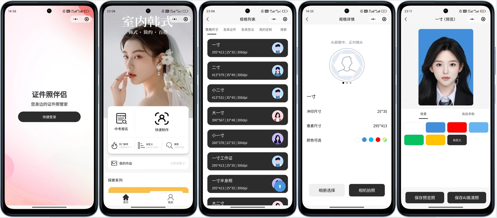
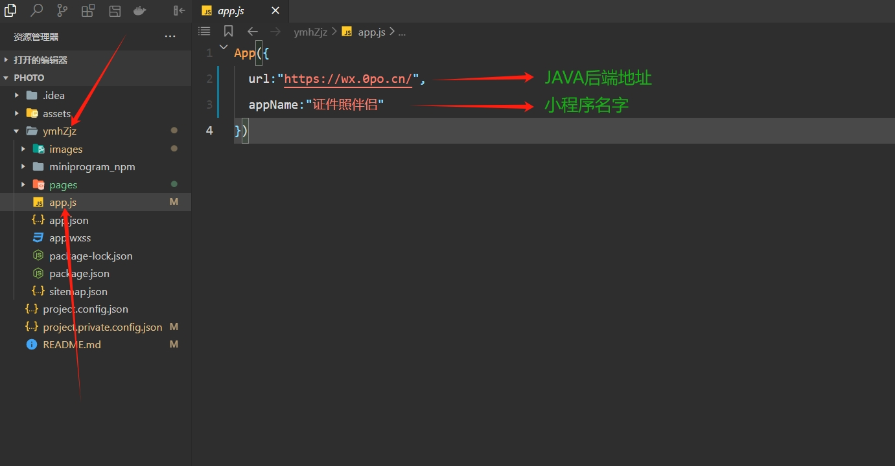
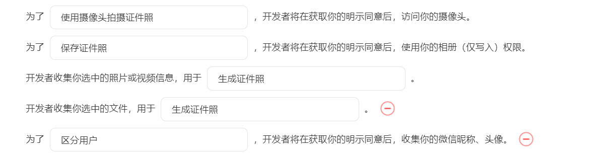
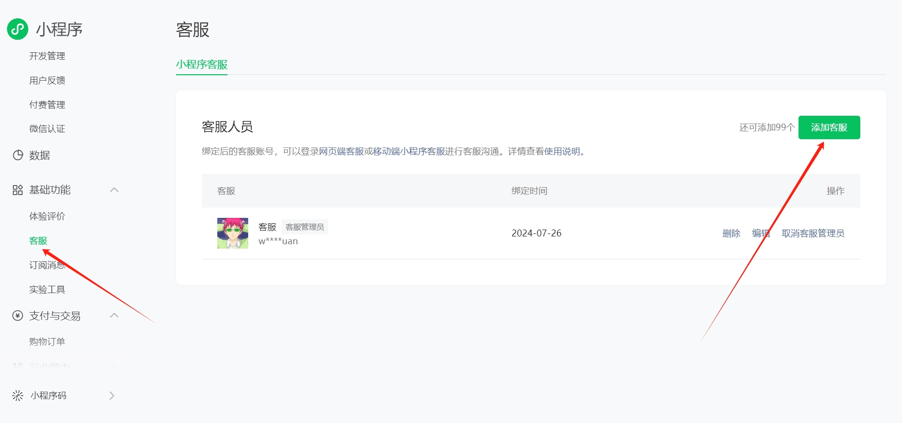

# 项目介绍

# 
证件照伴侣

快图证件照前端，焕然一新，活力十足

**相关项目**：
- 小程序前端第一套：https://github.com/no1xuan/photo
- 小程序前端第二套：https://github.com/no1xuan/ai-photo
- 小程序后端：https://github.com/no1xuan/HivisionIDPhotos-wechat-weapp
- 小程序管理员网页后台：https://github.com/no1xuan/zjzAdmin

------

# ⭐最近更新
    版本更新教程：https://www.bilibili.com/video/BV1xNUvYTEjo

- 2024.11.29: 第一个版本诞生
- 二次开发源码来自: https://github.com/pixzone/id-photo-wechat
- 二开内容：全面接入证件照伴侣后端，去除原本复杂js，重写所有js，整理清晰目录，适配微信基础库版本：3.6.6，增加登录页，换底色更换成抠图
- 注：首页有3个图片，图片上面有错误信息，本人不会ps无法修改，同时欢迎大家提交PR，共同维护和推动项目的发展
------

# 🔧部署

微信开发者工具打开项目后，修改两处就好啦

## 隐私协议

## 客服配置

## 📧其它

您可以通过以下方式联系我:

QQ: 24677102

微信：webxuan
